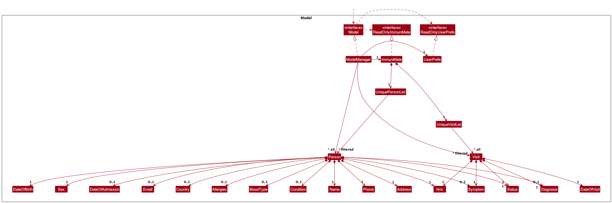
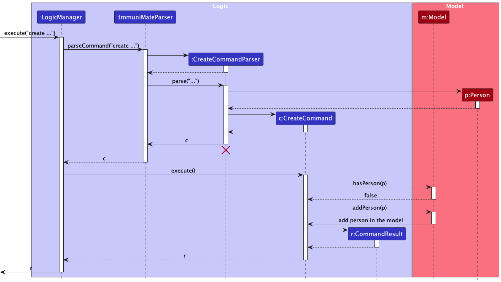
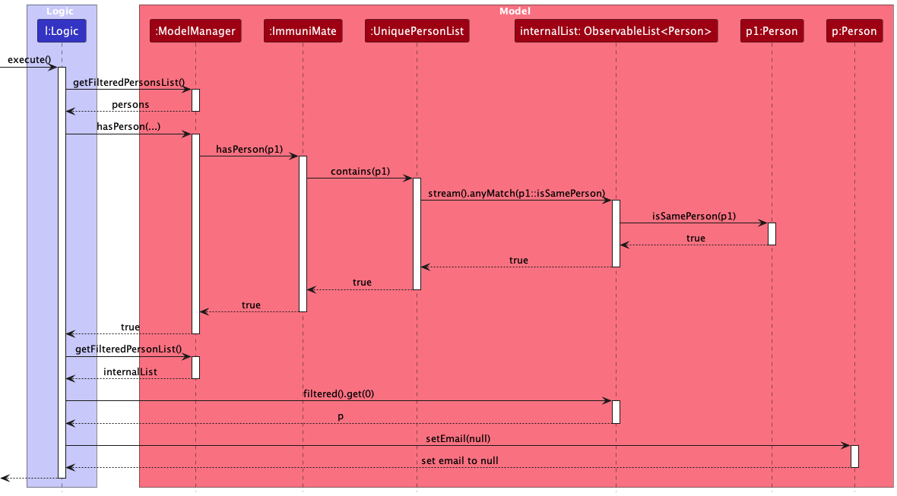
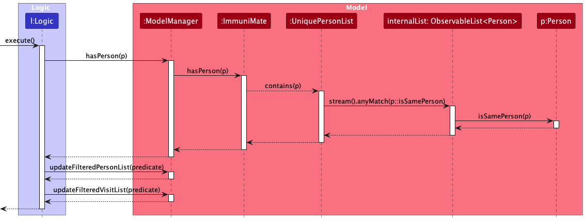

* Table of Contents
{:toc}

--------------------------------------------------------------------------------------------------------------------

## **Acknowledgements**

* {list here sources of all reused/adapted ideas, code, documentation, and third-party libraries -- include links to the original source as well}

--------------------------------------------------------------------------------------------------------------------

## **Setting up, getting started**

Refer to the guide [_Setting up and getting started_](SettingUp.md).

--------------------------------------------------------------------------------------------------------------------

## **Design**

:bulb: **Tip:** The `.puml` files used to create diagrams in this document `docs/diagrams` folder. Refer to the [_PlantUML Tutorial_ at se-edu/guides](https://se-education.org/guides/tutorials/plantUml.html) to learn how to create and edit diagrams.

### Architecture

The ***Architecture Diagram*** given above explains the high-level design of the App.

Given below is a quick overview of main components and how they interact with each other.

**Main components of the architecture**

**`Main`** (consisting of classes [`Main`](https://github.com/se-edu/addressbook-level3/tree/master/src/main/java/seedu/address/Main.java) and [`MainApp`](https://github.com/se-edu/addressbook-level3/tree/master/src/main/java/seedu/address/MainApp.java)) is in charge of the app launch and shut down.
* At app launch, it initializes the other components in the correct sequence, and connects them up with each other.
* At shut down, it shuts down the other components and invokes cleanup methods where necessary.

The bulk of the app's work is done by the following four components:

* [**`UI`**](#ui-component): The UI of the App.
* [**`Logic`**](#logic-component): The command executor.
* [**`Model`**](#model-component): Holds the data of the App in memory.
* [**`Storage`**](#storage-component): Reads data from, and writes data to, the hard disk.

[**`Commons`**](#common-classes) represents a collection of classes used by multiple other components.

**How the architecture components interact with each other**

The *Sequence Diagram* below shows how the components interact with each other for the scenario where the user issues the command `delete 1`.

Each of the four main components (also shown in the diagram above),

* defines its *API* in an `interface` with the same name as the Component.
* implements its functionality using a concrete `{Component Name}Manager` class (which follows the corresponding API `interface` mentioned in the previous point.

For example, the `Logic` component defines its API in the `Logic.java` interface and implements its functionality using the `LogicManager.java` class which follows the `Logic` interface. Other components interact with a given component through its interface rather than the concrete class (reason: to prevent outside component's being coupled to the implementation of a component), as illustrated in the (partial) class diagram below.

The sections below give more details of each component.

### UI component

The **API** of this component is specified in [`Ui.java`](https://github.com/se-edu/addressbook-level3/tree/master/src/main/java/seedu/address/ui/Ui.java)

The UI consists of a `MainWindow` that is made up of parts e.g.`CommandBox`, `ResultDisplay`, `PersonListPanel`, `StatusBarFooter` etc. All these, including the `MainWindow`, inherit from the abstract `UiPart` class which captures the commonalities between classes that represent parts of the visible GUI.

The `UI` component uses the JavaFx UI framework. The layout of these UI parts are defined in matching `.fxml` files that are in the `src/main/resources/view` folder. For example, the layout of the [`MainWindow`](https://github.com/se-edu/addressbook-level3/tree/master/src/main/java/seedu/address/ui/MainWindow.java) is specified in [`MainWindow.fxml`](https://github.com/se-edu/addressbook-level3/tree/master/src/main/resources/view/MainWindow.fxml)

The `UI` component,

* executes user commands using the `Logic` component.
* listens for changes to `Model` data so that the UI can be updated with the modified data.
* keeps a reference to the `Logic` component, because the `UI` relies on the `Logic` to execute commands.
* depends on some classes in the `Model` component, as it displays `Person` object residing in the `Model`.

### Logic component

**API** : [`Logic.java`](https://github.com/se-edu/addressbook-level3/tree/master/src/main/java/seedu/address/logic/Logic.java)

Here's a (partial) class diagram of the `Logic` component:

The sequence diagram below illustrates the interactions within the `Logic` component, taking `execute("delete 1")` API call as an example.

:information_source: **Note:** The lifeline for `DeleteCommandParser` should end at the destroy marker (X) but due to a limitation of PlantUML, the lifeline continues till the end of diagram.

How the `Logic` component works:

1. When `Logic` is called upon to execute a command, it is passed to an `AddressBookParser` object which in turn creates a parser that matches the command (e.g., `DeleteCommandParser`) and uses it to parse the command.
2. This results in a `Command` object (more precisely, an object of one of its subclasses e.g., `DeleteCommand`) which is executed by the `LogicManager`.
3. The command can communicate with the `Model` when it is executed (e.g. to delete a person). 
   Note that although this is shown as a single step in the diagram above (for simplicity), in the code it can take several interactions (between the command object and the `Model`) to achieve.
4. The result of the command execution is encapsulated as a `CommandResult` object which is returned back from `Logic`.

Here are the other classes in `Logic` (omitted from the class diagram above) that are used for parsing a user command:

How the parsing works:
* When called upon to parse a user command, the `AddressBookParser` class creates an `XYZCommandParser` (`XYZ` is a placeholder for the specific command name e.g., `AddCommandParser`) which uses the other classes shown above to parse the user command and create a `XYZCommand` object (e.g., `AddCommand`) which the `AddressBookParser` returns back as a `Command` object.
* All `XYZCommandParser` classes (e.g., `AddCommandParser`, `DeleteCommandParser`, ...) inherit from the `Parser` interface so that they can be treated similarly where possible e.g, during testing.

### Model component
**API** : [`Model.java`](https://github.com/se-edu/addressbook-level3/tree/master/src/main/java/seedu/address/model/Model.java)

The `Model` component,

* stores the patient data i.e., all `Person` objects (which are contained in a `UniquePersonList` object).
* stores the currently 'selected' `Person` objects (e.g., results of a search query) as a separate _filtered_ list which is exposed to outsiders as an unmodifiable `ObservableList<Person>` that can be 'observed' e.g. the UI can be bound to this list so that the UI automatically updates when the data in the list change.
* stores a `UserPref` object that represents the user’s preferences. This is exposed to the outside as a `ReadOnlyUserPref` objects.
* does not depend on any of the other three components (as the `Model` represents data entities of the domain, they should make sense on their own without depending on other components)

### Storage component

**API** : [`Storage.java`](https://github.com/se-edu/addressbook-level3/tree/master/src/main/java/seedu/address/storage/Storage.java)

The `Storage` component,
* can save both address book data and user preference data in JSON format, and read them back into corresponding objects.
* inherits from both `AddressBookStorage` and `UserPrefStorage`, which means it can be treated as either one (if only the functionality of only one is needed).
* depends on some classes in the `Model` component (because the `Storage` component's job is to save/retrieve objects that belong to the `Model`)

### Common classes

Classes used by multiple components are in the `seedu.addressbook.commons` package.

--------------------------------------------------------------------------------------------------------------------

## **Implementation**

This section describes some noteworthy details on how certain features are implemented.

### List all patients
#### Proposed Implementation

The `list` feature allows users to view all patients in the system through the `list` command. This patient data is then displayed in the system for the user to have an overview of all patients.
The `list` command is facilitated by `ListCommand` which extends the `Command` classes, listing all instances in the `Model`.

* `ListCommand#execute` is responsible for executing the command and listing all patients in the system.
* `Model#updateFilteredPersonList()` is called to make the UI display all patients in the system.

Step 1. `ListCommand#execute` is called by the `LogicManager`. The `ListCommand` calls `model.updateFilteredPersonList()` to update the filtered list of patients in the system.
Step 2. `Model#updateFilteredPersonList(PREDICATE_SHOW_ALL_PERSONS)` is called to update the filtered list such that it shows all patients in the system. 
Step 3. The `ListCommand` returns the appropriate `CommandResult` to indicate the success of the operation.

### Help
#### Proposed Implementation

The `help` feature allows users to view the link to User Guide. This command is facilitated by `HelpCommand` which extends the `Command` classes.

* `HelpCommand#execute` is responsible for executing the command and listing the link to the User Guide.

Step 1. Parser interprets the user's input and creates a new `HelpCommand` instance.
Step 2. `HelpCommand#execute` is called by the `LogicManager`. The `HelpCommand` returns the appropriate `CommandResult`, which signals the UI to display the help window .

### Create new patient
#### Proposed Implementation

The `create` feature allows users to create a patient by providing input through a command with specific arguments. This patient data is then stored within the system for future reference.
The `create` command is facilitated by `CreateCommand` and `CreateCommandParser`. They extend the `Command` and `Parser` classes respectively, storing a new instance of `Person` in the `UniquePersonList`.
* `CreateCommandParser#parse` is responsible for parsing the user input and creating a new `CreateCommand` instance.
* `CreateCommand#execute` is responsible for executing the command and adding the new patient to the system.
* `ImmuniMate#addPerson(Person)` is called to add the patient to the internal list of patients.
* `UniquePersonList#add(Person)` is used to add the new patient to the system.
`ModelManager#addPerson(Person)` is called to add the patient to the system. It calls `ImmuniMate.addPerson(Person)` which calls `UniquePersonList#add(Person)` to add the patient to the internal list of patients.
The command checks for duplicates in the system before adding the new patient.
* `Person#equals(Object)` is overridden to check if two patients are duplicates.
* `UniquePersonList#contains(Person)` is used to check if the patient already exists in the system's list of patients.
* `ImmuniMate#hasPerson(Person)` is used to check if the patient already exists in the system.
`ModelManager#hasPerson(Person)` is called to check if the patient already exists in the system. It calls `ImmuniMate.hasPerson(Person)` which calls `UniquePersonList#contains(Person)` to check if the patient already exists in the internal list of patients.

The creation of `Person` instance also rely on field classes, such as `Name`, `Nric`, `Phone`, `Address`, `DateOfBirth`, `Sex`, and `Status`. Optional field classes include `Email`, `Country`, `DateOfAdmission`, `BloodType`, `Allergies`, `Conditions`, `Symptoms`, and `Diagnosis`.

Step 1. `CreateCommandParser` interprets the user's input, creates instances of fields which matches the input, and creates a new `CreateCommand` instance.

Step 2. The `CreateCommand#execute` is called by the `LogicManager`. The `CreateCommand` checks if the patient already exists in the system by calling `model.hasPerson(person)`.

Step 3. If there is no duplicate, the patient is added to the system by calling `model.addPerson(person)`.

Step 4: After the patient is added, the `CreateCommand` returns the appropriate `CommandResult` to indicate the success of the operation.
The following sequence diagram shows how a create operation goes through the Logic component:

Similarly, the following sequence diagram shows how a create operation goes through the Model component:

### Delete patient
#### Proposed Implementation

The `delete` feature allows users to delete a patient by providing NRIC through a command. This patient data is then removed from the system.
The `delete` command is facilitated by `DeleteCommand` and `DeleteCommandParser`. They extend the `Command` and `Parser` classes respectively, removing an instance of `Person` from the `UniquePersonList`.

* `DeleteCommandParser#parse` is responsible for parsing the user input and creating a new `DeleteCommand` instance.
* `DeleteCommand#execute` is responsible for executing the command and removing the patient from the system.
* `ImmuniMate#removePerson(Person)` is called to remove the patient from the internal list of patients.
* `UniquePersonList#remove(Person)` is used to remove the patient from the system.
`ModelManager#deletePerson(Person)` is called to remove the patient from the system. It calls `ImmuniMate.removePerson(Person)` which calls `UniquePersonList#remove(Person)` to remove the patient from the internal list of patients.
`DeleteCommand` checks if the patient exists in the system before removing the patient.
* `ModelManager#hasPerson(Person)` is called to check if the patient already exists in the system. It calls `ImmuniMate.hasPerson(Person)` which calls `UniquePersonList#contains(Person)` to check if the patient already exists in the internal list of patients.

Step 1. `DeleteCommandParser` interprets the user's input for NRIC, and creates a new `DeleteCommand` instance.
Step 2. The `DeleteCommand#execute` is called by the `LogicManager`. The `DeleteCommand` checks if the patient exists in the system by calling `model.hasPerson(person)`.
Step 3. If the patient exists, the patient is removed from the system by calling `model.deletePerson(person)`.
Step 4: After the patient is removed, the `DeleteCommand` returns the appropriate `CommandResult` to indicate the success of the operation.

The following sequence diagram shows how a delete operation goes through the Logic component:

How a delete operation goes through the Model component is very similar to that of the create operation, therefore the sequence diagram is omitted.

### Delete patient information
#### Proposed Implementation

The `deleteinfo` command allows users to delete a patient's particular field of information by providing NRIC and the field to be deleted through a command. 
This `deleteinfo` command is facilitated by `DeleteInfoCommand` and `DeleteInfoCommandParser`. They extend the `Command` and `Parser` classes respectively, removing a particular field of information from the `Person` object.

* `DeleteInfoCommandParser#parse` is responsible for parsing the user input and creating a new `DeleteInfoCommand` instance.
* `DeleteInfoCommand#execute` is responsible for executing the command and removing the field of information from the patient.
* `Model#getFilteredPersonList()` is called to get the list of patients in the system.
* `Model#setField` where `Field` refers to whichever field specified to be deleted, is responsible for removing the field of information from the patient.
  `DeleteInfoCommand` checks if the patient exists in the system before removing the field of information.
* `ModelManager#hasPerson(Person)` is called to check if the patient already exists in the system. It calls `ImmuniMate.hasPerson(Person)` which calls `UniquePersonList#contains(Person)` to check if the patient already exists in the internal list of patients.

Step 1. `DeleteInfoCommandParser` interprets the user's input for NRIC and the fields to be deleted, and creates a new `DeleteInfoCommand` instance.
Step 2. The `DeleteInfoCommand#execute` is called by the `LogicManager`. The `DeleteInfoCommand` checks if the patient exists in the system by calling `model.hasPerson(person)`.
Step 3. If the patient exists, the `DeleteInfoCommand` calls `model.setField` (where the field is the specified field to delete) to get the list of patients in the system.
Step 4. `DeleteInfoCommand#execute` check which fields are to be deleted, and remove the field of information using `Person#setField(null)`. Where `Field` is the field to be deleted.
Step 5: After the field of information is removed, the `DeleteInfoCommand` returns the appropriate `CommandResult` to indicate the success of the operation.

The following sequence diagram shows how a deleteinfo operation goes through the Logic component:

The sequence diagram for how the deleteinfo operation goes through the Model Component is as the following:

### Read a patient's information
#### Proposed Implementation
The `read` feature allows users to read a patient profile by providing NRIC through a command. This patient data is then displayed.
The `read` command is facilitated by `ReadCommand` and `ReadCommandParser`. They extend the `Command` and `Parser` classes respectively, displaying patient profile from an instance of `Person` from the `UniquePersonList`.

* `ReadCommandParser#parse` is responsible for parsing the user input and creating a new `ReadCommand` instance.
* `ReadCommand#execute` is responsible for executing the command and displaying the patient profile from the system.
  `ReadCommand` checks if the patient exists in the system before displaying patient profile.
* `ModelManager#hasPerson(Person)` is called to check if the patient exists in the system. It calls `ImmuniMate.hasPerson(Person)` which calls `UniquePersonList#contains(Person)` to check if the patient already exists in the internal list of patients.
* `Model#updateFilteredPersonList(Predicate)` and is called to update the list to be of patient with specified NRIC in the system.
* `Model#getFilteredPersonList()` is called to get the list of patient with specified NRIC in the system.
* `Observablelist<Persons>#get(int)` is called to obtain `Person` object of patient with speicified NRIC.  
Step 1. `ReadCommandParser` interprets the user's input for NRIC, and creates a new `ReadCommand` instance.
Step 2. The `ReadCommand#execute` is called by the `LogicManager`. The `ReadCommand` checks if the patient exists in the system by calling `model.hasPerson(person)`.
Step 3. If the patient exists, the patient is obtained from the system by calling `model.updateFilteredPersonList(person)`, followed by calling `model.getFilteredPersonList()` and `Observablelist<Persons>#get(int)`.
Step 4: After the patient is obtained, the `ReadCommand` formats the patient profile by calling `Messages.format(person)` and returns the appropriate `CommandResult` to indicate the success of the operation.

The following sequence diagram shows how a delete operation goes through the Logic component:

How a read operation goes through the Model component is shown below:

### Find patient
#### Proposed Implementation

### Update patient fields
#### Proposed Implementation
Given below is an example usage scenario and how the update mechanism behaves at each step.

Step 1. The user launches the application for the first time.

Step 2. The user types `update T0123456A a/35 Bishan Road, #10-40 con/myopia` command to update the address and condition fields in the profile of the person with `Nric` T0123456A in the address book. This calls `immuniMateParser.parseCommand()`, which separates the user input into the command `update` and the rest of the arguments.

Step 3. As the command `update` matches `UpdateCommand.COMMAND_WORD`, `UpdateCommandParser().parse()` is called, taking in the rest of the arguments. Here, the arguments are checked if they are null values, then passed into `ArgumentTokenizer.tokenize()`, where they are separated into `Nric` and other provided fields by finding their respective prefixes, and stored in an `ArgumentMultimap`.

Step 4. Still in `UpdateCommandParser().parse()`, checks are then done to verify the validity of the `Nric` and that no duplicate prefixes are found. A new `UpdatePersonDescriptor` object is then created to store the fields present in `ArgumentMultimap`.

Step 5. At the end of `UpdateCommandParser().parse()`, a new `UpdateCommand` instance is created with the `Nric` and `UpdatePersonDescriptor` as arguments. `UpdateCommand.execute()` is then called, taking in the ImmuniMate `model` as an argument.

Step 6. `model.getFilteredPersonsList()` retrieves the list of `Person`s stored, and a check is done to see if ImmuniMate has a `Person` with the given `Nric`.  This `Person` is then retrieved from the list, while a new `Person`  object is instantiated, with the `Person` and `UpdatePersonDescriptor` as arguments, representing the retrieved `Person` object with fields updated.

Step 7. `model.setPerson()` then replaces the retrieved `Person` object with the new `Person` object with fields updated, taking in both `Person` objects as arguments. The `model` is then saved into `storage`.

#### Design considerations:

* **Alternative 1 (current choice):** Identify patient by `Nric`.
    * Pros: More user convenience, as user just needs to type NRIC patients provide

* **Alternative 2:** Identify patient by given `Index`.
    * Pros: Easier to implement.
    * Cons: Less user convenience, as user has to first know patient `Index` to find patient.

### Record patient visit
#### Proposed Implementation

### Check a patient's visit history
#### Proposed Implementation
The `check` feature allows users to check the visit history of a patient by providing NRIC through a command. This patient visit history is then displayed.
The `check` command is facilitated by `CheckCommand` and `CheckCommandParser`. They extend the `Command` and `Parser` classes respectively, displaying patient visit history from list of `Visit` from the `UniqueVisitList`.

* `CheckCommandParser#parse` is responsible for parsing the user input and creating a new `CheckCommand` instance.
* `CheckCommand#execute` is responsible for executing the command and displaying the patient visit history from the system.
  `CheckCommand` checks if the patient exists in the system before displaying patient visit history.
* `ModelManager#hasPerson(Person)` is called to check if the patient exists in the system. It calls `ImmuniMate.hasPerson(Person)` which calls `UniquePersonList#contains(Person)` to check if the patient already exists in the internal list of patients.
* `Model#updateFilteredPersonList(Predicate)` is called to get the list of patient with specified NRIC in the system.
* `Model#updateFilteredVisitList(Predicate)` is called to get the list of visits with specified NRIC in the system.
  Step 1. `CheckCommandParser` interprets the user's input for NRIC, and creates a new `CheckCommand` instance.
  Step 2. The `CheckCommand#execute` is called by the `LogicManager`. The `CheckCommand` checks if the patient exists in the system by calling `model.hasPerson(person)`.
  Step 3. If the patient exists, the patient is obtained from the system by calling `model.updateFilteredPersonList(pred)`, followed by calling `model.getFilteredPersonList()` and `Observablelist<Persons>#get(int)`.
  Step 4: Patient visit history is obtained from the system by calling `model.updateFilteredVisitList(pred)`, followed by `model.getFilteredVisitList()`.
  Step 5: After the patient visit history is obtained, the `CheckCommand` formats the patient visit history by calling `Messages.formatCheck(visit)` and returns the appropriate `CommandResult` to indicate the success of the operation.

The following sequence diagram shows how a delete operation goes through the Logic component:

How a check operation goes through the Model component is shown below:

### Check for clusters
#### Proposed Implementation

### Exit the app
#### Proposed Implementation

#### Design considerations:

--------------------------------------------------------------------------------------------------------------------

## **Documentation, logging, testing, configuration, dev-ops**

* [Documentation guide](Documentation.md)
* [Testing guide](Testing.md)
* [Logging guide](Logging.md)
* [Configuration guide](Configuration.md)
* [DevOps guide](DevOps.md)

--------------------------------------------------------------------------------------------------------------------

## **Appendix: Requirements**

### Product scope

**Target user profile**:

* has a need to manage a significant number of patient information
* prefer desktop apps over other types
* can type fast
* prefers typing to mouse interactions
* is reasonably comfortable using CLI apps
* works at a gp clinic or similar environments

**Value proposition**: As the number of patients a General Practitioner grows, information management might prove complex, especially so for personal data. ImmuniMate offers a way to record comprehensive information about every patient, while ensuring timely updates and avoiding duplications/contradictions. It also seeks to establish links between patient for contact tracing and finding potential infectious clusters.

### User stories

Priorities: High (must have) - `* * *`, Medium (nice to have) - `* *`, Low (unlikely to have) - `*`

| Priority | As a …​           | I want to …​                                    | So that I can…​                                                              |
|---------|-------------------|-------------------------------------------------|------------------------------------------------------------------------------|
| `* * *` | New user          | see usage instructions                          | refer to instructions when I forget how to use the App                       |
| `* * *` | Healthcare Worker | create a new patient profile                    | add new patient to database                                                  |
| `* * *` | Healthcare Worker | delete a patient                                | remove wrong or obselete patient profile from the database                   |
| `* * *` | Healthcare Worker | delete patient's information                    | remove patient information that is known to be incorrect                     |
| `* * *` | Healthcare Worker | read a patient's information by NRIC            | locate details of persons without having to go through the entire list       |
| `* * *` | Healthcare Worker | update a person's details                       | keep the details up to date                                                  |
| `* * *` | Healthcare Worker | find a patient by matching criteria             | Find a list of patients from with a certain conditio or address              |
| `* * *` | Healthcare Worker | find a patient by name                          | find a patient in the situation when their NRIC is not immediately available |
| `* * *` | Healthcare Worker | record visits made by patients                  | record the change in health condition of the patients across time            |
| `* *`   | Healthcare Worker | highlight contradicting information and entries | minimize the mistakes in entries                                             |
| `* *`   | Healthcare Worker | see the history of visits made by a patient     | understand the past health condition of a patient                            |
| `* *`   | Healthcare Worker | be able to tap different contact methods        | make sure important information is sent                                      |
| `* *`   | Healthcare Worker | status of health of a patient                   | give appropriate treatment                                                   |
| `* *`   | Healthcare Worker | see clusters of infected patients               | understand which areas are at high risk of infection                         |
| `*`     | Healthcare Worker | find the person who first spread the disease    | better understand the disease                                                |
| `*`     | Healthcare Worker | sort persons by name                            | locate a person easily                                                       |
| `*`     | Healthcare Worker | hide private contact details                    | minimize chance of someone else seeing them by accident                      |
| `*`     | Healthcare Worker | be able to resolve duplicate information        | correct wrong inputs                                                         |
| `*`     | Healthcare Worker | see the close contacts of a patient             | see the links between infected patients                                      |
### Use cases

(For all use cases below, the **IMS** is the `ImmuniMate system` and the **Healthcare worker** is the `user`, unless specified otherwise)

**Use Case: UC01 - Create Patient Profile**

- **Actor:** Healthcare Worker
- **Description:** Healthcare worker creates a new patient profile in the ImmuniMate Address Book System.
- **Preconditions:** Healthcare worker has logged into the system.
- **Guarantees:** New patient profile is successfully created in the ImmuniMate Address Book System.
- **MSS:**
    1. Healthcare worker choose to create a new patient profile.
    2. IMS requests the necessary details for the new patient profile (name, NRIC, date of birth, sex, phone number, address, email, country of nationality, date of admission, blood type, allergies).
    3. Healthcare worker enters the patient's details.
    4. IMS validates the entered data.
    5. IMS adds the new patient profile to the database.
- **Extensions:**

  3a. IMS detects a conflict in the entered data (user existing).

  3a1. IMS shows the conflicting existing entry
  3a2. IMS requests for the correct data.
  3a3. Healthcare Worker enters new data.
  Steps 3a1-3a3 are repeated until the data entered are correct, or the user cancels the action.
  Use case resumes from step 4.

  3b. IMS detects an error in the entered data.

  3b1. IMS requests for the correct data.
  3b2. Healthcare Worker enters new data.
  Steps 3b1-3b2 are repeated until the data entered are correct.
  Use case resumes from step 4.

  *a. At any time, Healthcare Worker chooses to cancel creating the patient profile.

  *a1. IMS requests confirmation to cancel.
  *a2. Healthcare Worker confirms the cancellation.
  Use case ends.

---

**Use Case: UC02 - Read Patient Profile**

- **Actor:** Healthcare Worker
- **Description:** Healthcare worker reads patient profile in the ImmuniMate Address Book System.
- **Preconditions:** Healthcare worker has logged into the system.
- **Guarantees:** Existing patient profile  in the ImmuniMate Address Book System is successfully displayed.
- **MSS:**
    1. Healthcare worker choose to read a patient profile.
    2. IMS requests the necessary detail for reading patient profile (NRIC).
    3. Healthcare worker enters the patient's details.
    4. IMS validates the entered data.
    5. IMS displays the patient profile to the database.
- **Extensions:**

  3a. IMS detects an error in the entered data (user does not exist).

  3a1. IMS shows the conflicting existing entry
  3a2. IMS requests for the correct data.
  3a3. Healthcare Worker enters new data.
  Steps 3a1-3a3 are repeated until the data entered are correct, or the user cancels the action.
  Use case resumes from step 4.

  3b. IMS detects an error in the entered data (wrong NRIC format).

  3b1. IMS requests for the correct data.
  3b2. Healthcare Worker enters new data.
  Steps 3b1-3b2 are repeated until the data entered are correct.
  Use case resumes from step 4.

  *a. At any time, Healthcare Worker chooses to cancel creating the patient profile.

  *a1. IMS requests confirmation to cancel.
  *a2. Healthcare Worker confirms the cancellation.
  Use case ends.

---

**Use Case: UC03 - Find Patient Information**

- **Actor:** Healthcare Worker
- **Description:** Healthcare worker searches for specific patient information in the ImmuniMate Address Book System.
- **Preconditions:** Healthcare worker has logged into the system.
- **Guarantees:** Relevant patient information is displayed for the healthcare worker to view.
- **Basic Flow:**
    1. Healthcare worker chooses to find patient information meeting specified criteria.
    2. IMS searches for and displays the relevant patients.
- **Extensions:**
  2a. IMS detects an error in the entered data.

  - 2a1. IMS requests for the correct data.
  - 2a2. Healthcare Worker enters new data.
  - Steps 2a1-2a2 are repeated until the data entered are correct. Use case resumes from step 3.

---

**Use Case: UC04 - Update Patient Information**

- **Actor:** Healthcare Worker
- **Description:** Healthcare worker updates a patient's information in the ImmuniMate Address Book System.
- **Preconditions:** Healthcare worker has logged into the system and has selected the patient whose information needs to be updated.
- **Guarantees:** Patient's information is successfully updated in the ImmuniMate Address Book System.
- **Basic Flow:**
    1. Healthcare worker chooses to update a certain patient’s certain information.
    2. IMS validates the new content.
    3. IMS updates the patient's information in the database.
- **Extensions:**

  2a. IMS detects an error in the entered data.

  2a1. IMS requests for the correct data.
  2a2. Healthcare Worker enters new data.
  Steps 2a1-2a2 are repeated until the data entered are correct.
  Use case resumes from step 3.

---

**Use Case: UC05 - Delete Patient Profile**

- **Actor:** Healthcare worker
- **Description:** Healthcare worker deletes a patient's record from the ImmuniMate Address Book System.
- **Preconditions:** Healthcare worker has opened the app and has selected the patient whose record needs to be deleted.
- **Guarantees:** Patient's record is successfully deleted from the ImmuniMate Address Book System.
- **MSS:**
    1. Healthcare worker choose to delete a specified patient’s record.
    2. IMS validates the NRIC and deletes the patient's record from the database.
- **Extensions:**

  2a. IMS cannot find the patient specified.
  - 2a1. IMS requests for the correct NRIC.
  - 2a2. Healthcare worker enters new NRIC.
  - Steps 2a1-2a2 are repeated until the data entered are correct or Healthcare worker cancels the action. Use case resumes from step 3.

**Use Case: UC06 - Delete Patient Information**

- **Actor:** Healthcare Worker
- **Description:** Healthcare worker deletes specific information from a patient's record in the ImmuniMate Address Book System.
- **Preconditions:** Healthcare worker has logged into the system and has selected the patient whose information needs to be deleted.
- **Guarantees:** Specified information is successfully deleted from the patient's record in the ImmuniMate Address Book System.
- **MSS:**
    1. Healthcare worker chooses to delete certain fields of a certain patient's profile.
    2. IMS validates the information to be deleted and deletes the specified information from the patient's record in the database.
- **Extensions:**

  2a. IMS cannot find the patient specified.
  - 2a1. IMS requests for the correct NRIC.
  - 2a2. Healthcare worker enters new NRIC.
  - Steps 2a1-2a2 are repeated until the data entered are correct or Healthcare worker cancels the action. Use case resumes from step 3.

  2b. IMS cannot find the specified information.

  - 2b1. IMS alerts healthcare worker that the specified information is not found.
  - 2b2. Healthcare worker enters new field.
  - Steps 2b1-2b2 are repeated until the data entered are correct or Healthcare worker cancels the action. Use case resumes from step 3.

  2c. Healthcare worker chooses to delete a mandatory field.

  - 2c1. IMS alerts healthcare worker that mandatory field cannot be deleted.
  - 2c2. Healthcare worker enters new field.
  - Steps 2c1-2c2 are repeated until the data entered are correct or Healthcare worker cancels the action. Use case resumes from step 3.

---

**Use Case: UC07 - Add Patient Visit**

- **Actor:** Healthcare Worker
- **Description:** Healthcare worker adds a visit record for a patient in the ImmuniMate Address Book System.
- **Preconditions:** Healthcare worker has logged into the system.
- **Guarantees:** A new visit record is successfully added for the patient in the ImmuniMate Address Book System.
- **Main Success Scenario (MSS):**
  1. Healthcare worker chooses to add a new patient visit.
  2. IMS requests the necessary details for the visit (NRIC, date of visit, diagnosis, symptoms, status).
  3. Healthcare worker enters the required information for the visit.
  4. IMS validates the entered data.
  5. IMS adds the visit record to the patient's profile in the database.
  6. IMS confirms that the visit has been added successfully.
  7. Use case ends.

- **Extensions:**

  3a. IMS detects an error in the entered data (patient does not exist).
  - 3a1. IMS notifies Healthcare Worker that the patient does not exist.
  - 3a2. Healthcare Worker opts to create a new patient profile or re-enters correct data.
  - Steps 3a1-3a2 are repeated until valid data are entered, or the user cancels the action.
  - Use case resumes from step 4 if valid data are entered.

  3b. IMS detects an error in the entered data (e.g., incorrect NRIC format, invalid date of visit).
  - 3b1. IMS requests for the correct data.
  - 3b2. Healthcare Worker enters new data.
  - Steps 3b1-3b2 are repeated until the data entered are correct.
  - Use case resumes from step 4.

  3c. IMS detects missing mandatory fields (e.g., NRIC, date of visit).
  - 3c1. IMS displays an error message indicating which fields are missing.
  - 3c2. Healthcare Worker provides the missing information.
  - Steps 3c1-3c2 are repeated until all required data are provided.
  - Use case resumes from step 4.

  *a. At any time, Healthcare Worker chooses to cancel the addition of the patient visit.
  - *a1. IMS requests confirmation to cancel.
  - *a2. Healthcare Worker confirms the cancellation.
  - Use case ends.

---

**Use Case: UC08 - Check Patient Visit History**

- **Actor:** Healthcare Worker
- **Description:** Healthcare worker checks patient visit history in the ImmuniMate Address Book System.
- **Preconditions:** Healthcare worker has logged into the system.
- **Guarantees:** Existing patient visit history in the ImmuniMate Address Book System is successfully displayed.
- **MSS:**
    1. Healthcare worker choose to check a patient visit history.
    2. IMS requests the necessary detail for checking patient visit history (NRIC).
    3. Healthcare worker enters the patient's details.
    4. IMS validates the entered data.
    5. IMS displays the patient profile to the database.
- **Extensions:**

  3a. IMS detects an error in the entered data (user does not exist).

  3a1. IMS shows the conflicting existing entry
  3a2. IMS requests for the correct data.
  3a3. Healthcare Worker enters new data.
  Steps 3a1-3a3 are repeated until the data entered are correct, or the user cancels the action.
  Use case resumes from step 4.

  3b. IMS detects an error in the entered data (wrong NRIC format).

  3b1. IMS requests for the correct data.
  3b2. Healthcare Worker enters new data.
  Steps 3b1-3b2 are repeated until the data entered are correct.
  Use case resumes from step 4.

  *a. At any time, Healthcare Worker chooses to cancel creating the patient profile.

  *a1. IMS requests confirmation to cancel.
  *a2. Healthcare Worker confirms the cancellation.
  Use case ends.

### Non-Functional Requirements

1.  Should work on any _mainstream OS_ as long as it has Java `11` or above installed.
2.  Should be able to hold up to 1000 persons without a noticeable sluggishness in performance for typical usage.
*{More to be added}*

Data Requirements:
* the app should have high data persistency

Environment Requirements:
* the app should work on both 32-bit and 64-bit environments

Accessibility:
* the app should be easily downloaded from websites/app stores, and need no prior setup

Capacity:
* the app should be able to store 10000 profiles 
* the app should not exceed 10GB in storage space

Compliance with regulations:
* personal data collection on the app should adhere to the Personal Data Protection Act (PDPA)

Extensibility:
* the app should enable new profile fields to be added easily
* the app should be convenient to expand its capacity when needed

Interoperability:
* the app should be compatible with Windows, MacOS, Linux platforms

Maintainability:
* the app should use automated testing

Performance requirements:
* the app should respond to queries within 1 second

Process requirements:
* the project should adhere to a schedule to deliver new features fortnightly
* the project should aim to solve bugs found in one version by the next version

Quality requirements:
* the app should be usable by doctors/nurses/receptionists with limited guidance
* the app should be faster to use by typing queries than using the mouse

### Glossary

1. **Name**: The name of the patient. Case-sensitive alphabetical characters with spaces, capped at 2,000,000,000 characters.
2. **NRIC**: National Registration Identity Card number, follows Singapore NRIC format. 9 characters. First character can be any of S, T, followed by 7 digits, and the last character is an alphabet. NRIC is case-insensitive.
3. **Date of Birth (DOB)**: The patient's date of birth, in the format `yyyy-MM-dd`.
4. **Sex**: The biological sex of the patient, limited to `M` or `F`.
5. **Phone Number**: The contact number of the patient, limited to 8 digits.
6. **Address**: The home address of the patient. Any text except blank and empty text is accepted.
7. **Email**: The email address of the patient, follows a valid format: `<a-zA-Z0-9>@<a-zA-Z0-9>.com`. Case-sensitive.
8. **Country of Nationality**: The country name of the patient's nationality. Any text except blank and empty text is accepted.
9. **Date of Admission (DOA)**: The date when the patient was admitted for the first visit, in the format `yyyy-MM-dd`.
10. **Blood Type**: The blood type of the patient. accepts any of `A+`, `A-`, `B+`, `B-`, `AB+`, `AB-`, `O+`, `O-`.
11. **Allergies**: Any allergies the patient may have. Any text except blank and empty text is accepted.
12. **Conditions**: Any prior medical conditions of the patient. Any text except blank and empty text is accepted.
13. **Symptoms**: The latest symptoms experienced by the patient. Any text except blank and empty text is accepted.
14. **Diagnosis**: The latest diagnosis of the patient's condition. Any text except blank and empty text is accepted.
15. **Status**: The current health status of the patient, can be `HEALTHY` (green), `PENDING` (yellow), or `UNHEALTHY` (red). `PENDING` means the patient still need upcoming diagnosis to determine the current health status.
16. **Date of Visit**: The date of the patient's current visit, in the format `yyyy-MM-dd`.
17. **Fields**: The fields of the patient's information, such as name, status, contact.
17. **Cluster**: A group of patients who are infected by the same disease.
18. **Patient Visit**: A record of a patient's one specific visit to the clinic, including the date of visit, symptoms, diagnosis, and status.
19. **Patient History**: A collection of all the visits by a patient.
20. **Patient Profile**: A collection of all the information about a patient, including the patient's name, NRIC, phone number, address, email, country.

--------------------------------------------------------------------------------------------------------------------

## **Appendix: Instructions for manual testing**

Given below are instructions to test the app manually.

:information_source: **Note:** These instructions only provide a starting point for testers to work on;
testers are expected to do more *exploratory* testing.

### Launch and shutdown

1. Initial launch

   1.1 Download the jar file and copy into an empty folder.

   1.2 Run `java -jar immuniMate.jar` for the jar file Expected: Shows the GUI with a set of sample contacts.

2. Saving window preferences

   2.1 Move the window to a different location. Close the window.

   2.2 Re-launch the app by running `java -jar ImmuniMate.jar` again. 
       Expected: The most recent window size and location is retained.

### Adding a person

1. Adding a person while all persons are being shown.
   1. Prerequisites: 
      1. List all persons using the `list` command. Multiple persons in the list.
      1. The person with NRIC `S1234567A` is not already created in the system.
      1. The person with NRIC `T0234567C` is already created in the system.
   1. Test case: `create n/Alice Tan ic/S1234567A dob/1990-01-01 hp/12345678 a/123, Jurong West Ave 6, #08-111 s/F st/PENDING` 
      Expected: A new person is added to the list. The result panel shows the details of the new person.
   1. Test case: `create n/Bob Tan ic/T0234567C dob/1990-01-01 hp/12345678 a/123, Jurong West Ave 6, #08-111 s/M st/PENDING` 
      Expected: A new person is not added to the list. The result panel shows an error message, indicating that the person already exists in the system.
   1. Test case: `create n/Charlie Tan ic/S1234567A` 
      Expected: A new person is not added to the list. The result panel shows an error message, indicating that the command format is invalid.
2. Adding a person while only some persons are being shown
   1. Prerequisites: 
      1. Show only 1 person's details using the `find n/alex` command. One person is shown in the list.
   1. Test case: `create n/Bob Tan ic/T0234567C dob/1990-01-01 hp/12345678 a/123, Jurong West Ave 6, #08-111 s/M st/PENDING` 
      Expected: A new person is not added to the list. The result panel shows an error message, indicating that the person already exists in the system.

### Reading a person
1. Reading a person while all persons are being shown.
    1. Prerequisites:
       1. List all persons using the `list` command. Multiple persons in the list.
       1. The person with NRIC `S1234567A` is already created in the system with a `create` command.

   1. Test case: `read S1234567A` 
      Expected: Details of the read patient shown in result panel. The list panel shows the read person.

   1. Test case: `read S9876543N` 
      Expected: No person is read. Error details shown.

   1. Other incorrect read commands to try: `read`, `read 0`, `...` (where the input for NRIC field does not follow format for NRIC) 
      Expected: Similar to previous.
   2. 
2. Reading a person while only some persons are being shown
    1. Prerequisites:
        2. Show only 1 person's details using the `find n/alex` command. One person is shown in the list.
        3. The person with NRIC `S1234567A` is already created in the system with a `create` command.
    1. Test case: `read S1234567A` 
       Expected: The result panel shows the details of the read person. The list panel shows the read person.

### Deleting a person

1. Deleting a person while all persons are being shown

   1. Prerequisites: 
      1. List all persons using the `list` command. Multiple persons in the list.
      1. The person with NRIC `S1234567A` is already created in the system with a `create` command.

   1. Test case: `delete S9234568N` 
      Expected: First patient is deleted from the list. Details of the deleted patient shown in the status message. Timestamp in the status bar is updated.

   1. Test case: `delete S9876543N` 
      Expected: No person is deleted. Error details shown in the status message. Status bar remains the same.

   1. Other incorrect delete commands to try: `delete`, `delete 0`, `...` (where the input for NRIC field does not follow format for NRIC) 
      Expected: Similar to previous.
2. Deleting a person while only some persons are being shown
   1. Prerequisites:
      1. Show only 1 person's details using the `find n/alex` command. One person is shown in the list.
      1. The person with NRIC `S1234567A` is already created in the system with a `create` command.
   1. Test case: `delete S1234567A` 
      Expected: The person is deleted from the list. The result panel shows the details of the deleted person. The list panel shows a full list of patients.

### Updating a person
1. Updating a existing person's updatable fields
   1. Prerequisites:
      1. The person with NRIC `S1234567A` is already created in the system with a `create` command.
   1. Test case: `update S1234567A a/35 Bishan Road, #10-40 con/myopia` 
      Expected: The person's address is updated to `35 Bishan Road, #10-40` and condition is updated to `myopia`. The result panel shows the updated person's details.
   2. Test case: `update S1234567A a/35 Bishan Road, #10-40 con/` 
      Expected: The person's both fields are not updated. The result panel shows an error message, indicating that the argument for condition is invalid.
   3. Test case: `update S1234567A` 
      Expected: The person is not updated at all. The result panel shows an error message, indicating that the command format is invalid.
2. Updating a non-existing person
   1. Prerequisites:
      1. The person with NRIC `S1234568A` does not exist in the system.
   2. Test case: `update S1234568A a/35 Bishan Road, #10-40 con/myopia` 
      Expected: The person is not updated at all. The result panel shows an error message, indicating that the person does not exist in the system.
3. Updating a person's non-updatable fields
   1. Prerequisites:
       1. The person with NRIC `S1234567A` is already created in the system with a `create` command.
   1. Test case: `update S1234567A a/35 Bishan Road, #10-40 con/myopia ic/S1234568A` 
      Expected: The person's address is updated to `35 Bishan Road, #10-40` and condition is updated to `myopia`. The NRIC is not updated.
### Finding a person

1. Finding a person by name, condition or address
    1. Prerequisites:
       1. The person with name `Alex Yeoh` exists in the system.
       1. The person with condition `diabetes` exists in the system.
       1. The person with address `123, Jurong West Ave 6, #08-111` exists in the system.
    1. Test case: `find n/Alex Yeoh` 
       Expected: The person with name `Alex Yeoh` is shown in the list. The result panel shows the details of the person.
    1. Test case: `find con/diabetes` 
       Expected: The person with condition `diabetes` is shown in the list. The result panel shows the details of the person.
    1. Test case: `find a/123, Jurong West Ave 6, #08-111` 
       Expected: The person with address `123, Jurong West Ave 6, #08-111` is shown in the list. The result panel shows the details of the person.
2. Finding a person by NRIC
    1. Test case: `find n/S1234567A` 
       Expected: The person with NRIC `S1234567A` is not shown in the list. The result panel shows an error message, indicating that the command format is invalid.

### Deleting a person's information

1. Deleting a person's optional fields
    1. Prerequisites:
       1. The person with NRIC `S1234567A` exists in the system.
       2. The person with NRIC `S1234568A` does not exist in the system.
    1. Test case: `deleteinfo S1234567A a/` 
       Expected: The person's address becomes null. The result panel shows the updated person's details.
    1. Test case: `deleteinfo S1234567A a/ con/` 
       Expected: The person's address and condition become null. The result panel shows the updated person's details.
    1. Test case: `deleteinfo S1234567A` 
       Expected: The person's information is not deleted. The result panel shows an error message, indicating that the command format is invalid.
    1. Test case: `deleteinfo S1234568A e/` 
       Expected: The person's name is not deleted. The result panel shows an error message, indicating that the person does not exist in the system.
2. Deleting a person's mandatory fields
    1. Prerequisites:
       1. The person with NRIC `S1234567A` exists in the system.
    1. Test case: `deleteinfo S1234567A n/` 
       Expected: The person's name is not deleted. The result panel shows an error message, indicating that the name field cannot be deleted.

### Adding a person's visit 

### Checking a person's visit history
1. Checking a person while all persons are being shown.
    1. Prerequisites:
        1. List all persons using the `list` command. Multiple persons in the list.
        1. The person with NRIC `S1234567A` is already created in the system with a `create` command.

    1. Test case: `check S1234567A` 
       Expected: Details of the checked person's visit history is shown in the result panel. The list panel shows the checked person.

    1. Test case: `check S9876543N` 
       Expected: No person is checked. Error details shown.

    1. Other incorrect read commands to try: `check`, `check 0`, `...` (where the input for NRIC field does not follow format for NRIC) 
       Expected: Similar to previous.
    2.
2. Checking a person while only some persons are being shown
    1. Prerequisites:
        2. Show only 1 person's details using the `find n/alex` command. One person is shown in the list.
        3. The person with NRIC `S1234567A` is already created in the system with a `create` command.
    1. Test case: `check S1234567A` 
       Expected: The result panel shows the details of the checked person's visit history. The list panel shows the checked person.

### Saving data

1. Dealing with missing/corrupted data files

   1. _{explain how to simulate a missing/corrupted file, and the expected behavior}_

1. _{ more test cases …​ }_

## Planned enhancements
**Include FIN as accepted values for field `NRIC`**: The field `NRIC` should accept `F`, `M` and `G` as valid values, as they are valid first characters for foreigners' FIN (foreign identification number).
**Make `email` case-insensitive**: The field `Email` should be case-insensitive, as emails are not case-sensitive in practice.
**Limit `country` to a list of valid countries**: The field `country` should be limited to a list of countries, to prevent invalid entries.
