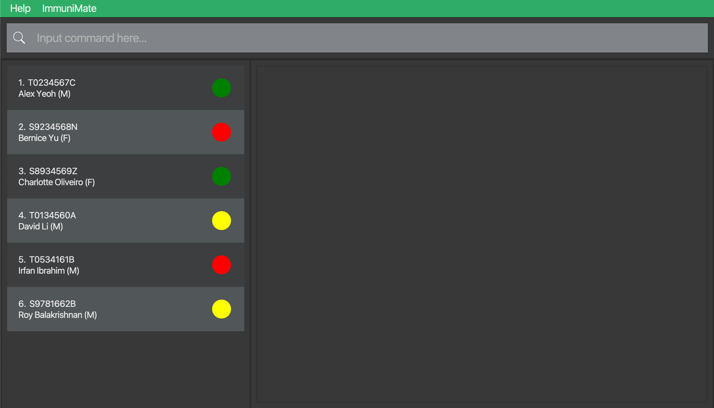
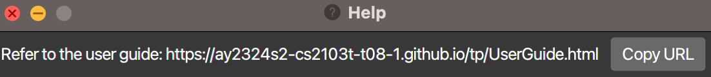
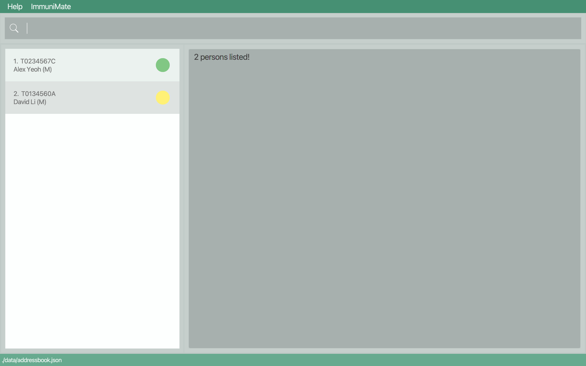
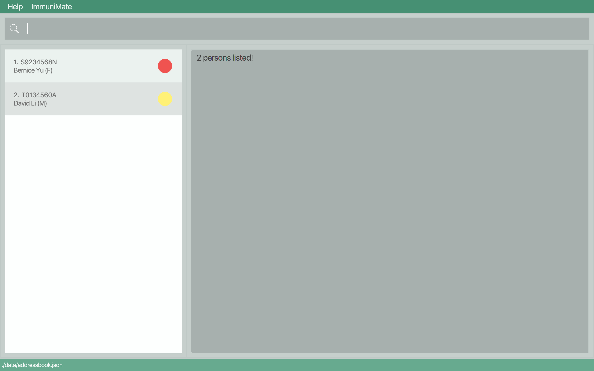

## Introduction
As communities grow, information management might prove complex for General Practitioner Clinics and other small-scale healthcare clinics, especially so for personal data. **ImmuniMate** offers a way to record comprehensive information about every patient, while ensuring timely updates and avoiding duplications/contradictions. It also seeks to establish links between patients for cluster tracking.

* Table of Contents
{:toc}

--------------------------------------------------------------------------------------------------------------------

## Quick start

1. Ensure you have Java `11` or above installed in your Computer.

2. Download the latest `immuniMate.jar` from [here](https://github.com/AY2324S2-CS2103T-T08-1/tp/releases).

3. Copy the file to the folder you want to use as the _home folder_ for your ImmuniMate.

4. Open a command terminal, `cd` into the folder you put the jar file in, and use the `java -jar immuniMate.jar` command to run the application. 
   A GUI similar to the below should appear in a few seconds. Note how the app contains some sample data. 
   

5. Type the command in the command box and press Enter to execute it. e.g. typing **`help`** and pressing Enter will open the help window. 
   Some example commands you can try:

   * `list` : Lists all contacts.

   * `create ic/S0123456A n/John Doe hp/98765432 e/johnd@example.com a/311, Clementi Ave 2, #02-25 dob/1990-01-01 s/M st/PENDING` : Adds a patient named `John Doe` to ImmuniMate.

   * `delete S0123456A` : Deletes the patient of respective NRIC.

   * `clear` : Deletes all contacts.

   * `exit` : Exits the app.

6. Refer to the [Features](#features) below for details of each command.

--------------------------------------------------------------------------------------------------------------------

## Features

**:information_source: Notes about the command format:** 

* Words in `UPPER_CASE` are the parameters to be supplied by the user. 
  e.g. in `update <NRIC> <field>/CONTENT`, `CONTENT` is a parameter which can be used as `update S0123456A hp/87654321`.

* Items in angle brackets are mandatory.  
  e.g. `ic/<NRIC>` must be given.

* Items in square brackets are optional. 
  e.g. `ic/<NRIC> [e/EMAIL]` can be used as `ic/S0123456A e/jd123@example.com` or as `ic/S0123456A`.

* Parameters can be in any order. 
  e.g. if the command specifies `n/<Patient_Name> hp/<Phone_Number>`, `hp/<Phone_Number> n/<Patient_Name>` is also acceptable.

* Extraneous parameters for commands that do not take in parameters (such as `help`, `list`, `exit` and `clear`) will be ignored. 
  e.g. if the command specifies `help 123`, it will be interpreted as `help`.

* If you are using a PDF version of this document, be careful when copying and pasting commands that span multiple lines as space characters surrounding line-breaks may be omitted when copied over to the application.

### Viewing help : `help`

Shows a message explaining how to access the help page.

Format: `help`

### Creating a patient profile: `create`

Creates a patient profile in ImmuniMate. 

Format: `create ic/<NRIC> n/<Patient_Name> hp/<Phone_Number> a/<Address> dob/<Date_of_birth> s/<Sex> st/<Status> [e/Email] [c/Country_of_Nationality] [doa/Date_of_Admission] [bt/Blood type] [al/Allergies] [con/Condition] [sym/Symptom] [d/diagnosis]`

* All mandatory fields must be provided.
* The unique identifier for each patient is the NRIC. The new NRIC must not already exist in the system.

Examples:
* `create ic/S1234567A n/John Doe hp/98765432 a/311, Clementi Ave 2, #02-25 dob/1990-01-01 s/M st/PENDING`
* `create ic/S0123456A n/Jane Doe hp/87654321 a/311, Clementi Ave 2, #02-25 dob/1990-01-01 s/F st/PENDING e/janed@example.com bt/A+`

For specification of each field, refer to the [Field summary](#field-summary) at the end of this User Guide.
### Listing all patients : `list`

Shows a list of all patients in ImmuniMate.

Format: `list`

### Read specific patients : `read`

Shows corresponding patient profile.

Format: `read <NRIC>`

Examples:
* `read S1234567A`

### Updating a patient's profile : `update`

Updates information of an existing patient profile in ImmuniMate.

Format: `update <NRIC> <Field>/CONTENT`

* Updates the patient of corresponding NRIC. 
* At least one of the fields must be provided.
* Existing values will be updated to the input values.
* NRIC cannot be updated, while all other values can be updated.

Examples:
*  `update S1234567A hp/91234567 e/jd123@example.com` Updates the phone number and email address of the corresponding patient to be `91234567` and `jd123@example.com` respectively.
*  `update S0123456A a/123 Serangoon Road` Updates the address of the corresponding person to be `123 Serangoon Road`

### Locating patients by name: `find`

Finds patients whose name contain any of the given keywords.

Format: `find n/[NAME] [NAME] [NAME] ...`

* The search is case-insensitive. e.g. `hans` will match `Hans`
* The order of the keywords does not matter. e.g. `Hans Bo` will match `Bo Hans`
* Only the name is searched.
* Only full words will be matched e.g. `Han` will not match `Hans`
* Patients matching at least one keyword will be returned (i.e. `OR` search).
  e.g. `Hans Bo` will return `Hans Gruber`, `Bo Yang`
* Names can be separated with any number of spaces

Examples:
* `find n/John` returns `john` and `John Doe`
* `find n/alex david` returns `Alex Yeoh`, `David Li` 
  

### Locating patients by address: `find`

Finds patients whose address contain any of the given keywords.

Format: `find a/[LOCATION], [LOCATION], [LOCATION], ...`

* The search is case-insensitive. e.g. `serangoon` will match `Serangoon`
* The order of the keywords does matter. e.g. `Clementi Ave` will not match `Ave Clementi`
* Only the address is searched.
* Partial words will be matched e.g. `Clem` will match `Clementi`
* Patients matching at least one keyword will be returned (i.e. `OR` search). 
  e.g. `Clementi, Serangoon` will return patients with address containing `Serangoon` or `Clementi`.
* Locations must be separated by commas, and whitespaces before and after each location will be ignored

Examples:
* `find a/Geylang` returns `Alex Yeoh`
* `find a/Serangoon` returns `Bernice Yu`, `David Li`
* `find a/geylang, serangoon, choa chu kang` returns `Alex Yeoh`, `Bernice Yu`, `David Li` 
  

### Locating patients by condition: `find`

Finds patients whose condition contain any of the given keywords.

Format: `find con/[CONDITION], [CONDITION], [CONDITION], ...`

* The search is case-insensitive. e.g. `covid` will match `Covid`
* The order of the keywords does matter. e.g. `Stomach FLu` will not match `Flu Stomach`
* Only the condition is searched.
* Partial words will be matched e.g. `Cov` will match `Covid`
* Patients matching at least one keyword will be returned (i.e. `OR` search).
  e.g. `Covid Dengue` will return patients with address containing `Covid` or `Dengue`
* Conditions must be separated by commas, and whitespaces before and after each condition will be ignored

Examples:
* `find con/covid, dengue, ebola `

### Deleting a patient : `delete`

Deletes the specified patient from ImmuniMate.

Format: `delete <NRIC>`

* Deletes the patient with corresponding NRIC.

Examples:
* `delete S1234567A` deletes patient uniquely identified by NRIC S1234567A.

### Deleting information of a patient : `deleteinfo`

Deletes specified optional information from the specified person from ImmuniMate.

Format: `deleteinfo <NRIC> <Field>`

* Deletes specified information of the patient with corresponding NRIC.

Examples:
* `deleteinfo S1234567A e/` deletes the email of patient uniquely identified by NRIC S1234567A.
* `deleteinfo S0123456A e/ bt/ c/` deletes the email, blood type and country of nationality of patient uniquely identified by NRIC S0123456A.

### Add patient's visit to history : `addvisit`

Adds visit to patient history. 

Format: `addvisit ic/<NRIC> dov/<Date_of_Visit> sym/<Symptoms> d/<Diagnosis> st/<Status>`

Examples:
* `addvisit ic/S1234567A dov/2024-01-01 sym/Cough d/Covid st/UNWELL` adds a visit to history of patient uniquely identified by NRIC S1234567A. During this visit on 2024-01-01, the patient had cough and was diagnosed with Covid.
* `addvisit ic/S0123456A dov/2024-02-02 sym/Fever,Rashes d/Dengue st/PENDING` adds a visit to history of patient uniquely identified by NRIC S0123456A. During this visit on 2024-02-02, the patient had fever and rashes, and was diagnosed with Dengue.
Date of visit: `yyyy-MM-dd` format.
### Check patient history : `check`

Checks all visits in patient history. 

Format: `check <NRIC>`

Example:
* `check S1234567A`displays all visits in history of patient uniquely identified by NRIC S1234567A.

### Cluster finding : `cluster`

Provided an integer, location, and illness, returns whether or not the number of people unwell with that illness (diagnosis in profile) in that area is at least that integer, and lists those people. 

Format: `cluster [CLUSTER SIZE] a/[LOCATION] d/[DIAGNOSIS]`

* The search is case-insensitive. e.g. `serangoon` will match `Serangoon`
* Only one location and diagnosis is searched
* Location and diagnosis cannot be empty
* Cluster size must be between 1 and 2,000,000,000
* Partial words will be matched e.g. `Clem` will match `Clementi`, `deng` will match `dengue`

Example: 
* `cluster 3 a/Serangoon d/dengue` finds dengue clusters of at least 3 in locations with the substring "Serangoon" 

### Clearing all entries : `clear`

Clears all profiles from ImmuniMate.

Format: `clear`

### Exiting the program : `exit`

Exits the program.

Format: `exit`

### Saving the data

ImmuniMate data are saved in the hard disk automatically after any command that changes the data. There is no need to save manually.

### Editing the data file

ImmuniMate data are saved automatically as a JSON file `[JAR file location]/data/immunimate.json`. Advanced users are welcome to update data directly by editing that data file.

:exclamation: **Caution:**
If your changes to the data file makes its format invalid, ImmuniMate will discard all data and start with an empty data file at the next run. Hence, it is recommended to take a backup of the file before editing it. 
Furthermore, certain edits can cause ImmuniMate to behave in unexpected ways (e.g., if a value entered is outside of the acceptable range). Therefore, edit the data file only if you are confident that you can update it correctly.

### Archiving data files `[coming in v2.0]`

### Update patient's visit in history `[coming in v2.0]`

### Infection cluster tracking `[coming in v2.0]`

--------------------------------------------------------------------------------------------------------------------

## FAQ

**Q**: How do I transfer my data to another Computer? 
**A**: Install the app in the other computer and overwrite the empty data file it creates with the file that contains the data of your previous ImmuniMate home folder.

**Q**: I entered a command and don't want to type it again, how can I go back to it?  
**A**: Use the arrow pad on the keyboard to navigate your Command History. 

--------------------------------------------------------------------------------------------------------------------

## Known issues

1. **When using multiple screens**, if you move the application to a secondary screen, and later switch to using only the primary screen, the GUI will open off-screen. The remedy is to delete the `preferences.json` file created by the application before running the application again.

--------------------------------------------------------------------------------------------------------------------

## Command summary

| Action                 | Format, Examples                                                                                                                                                                                                                                                                                                                                                      |
|------------------------|-----------------------------------------------------------------------------------------------------------------------------------------------------------------------------------------------------------------------------------------------------------------------------------------------------------------------------------------------------------------------|
| **Create**             | `create ic/<NRIC> n/<Patient_Name> hp/<Phone_Number> a/<Address> dob/<Date_of_birth> s/<Sex> st/<Status> [e/Email] [c/Country_of_Nationality] [doa/Date_of_Admission] [bt/Blood type] [al/Allergies] [con/Condition] [sym/Symptom] [d/diagnosis]`   e.g., `create ic/S1234567A n/John Doe hp/98765432 a/311, Clementi Ave 2, #02-25 dob/1990-01-01 s/M st/PENDING` |
| **Read**               | `read <NRIC>`   e.g., `read S1234567A`                                                                                                                                                                                                                                                                                                                             |
| **Update**             | `update <NRIC> <Field>/CONTENT`   e.g., `update S1234567A hp/91234567 e/jd123@example.com`                                                                                                                                                                                                                                                                         |
| **Find**               | `find n/KEYWORD`   e.g., `find n/Alex Bryan Charlie`   `find a/KEYWORD`   e.g., `find a/Serangoon, Geylang`   `find con/KEYWORD`   e.g., `find con/Covid, Ebola`                                                                                                                                                                                       |
| **Delete**             | `delete <NRIC>`  e.g., `delete S1234567A`                                                                                                                                                                                                                                                                                                                          |
| **Delete Information** | `deleteinfo <NRIC> <Field>`   e.g., `deleteinfo S1234567A e/`                                                                                                                                                                                                                                                                                                      |
| **Add Visit**          | `addvisit ic/<NRIC> dov/<Date_of_Visit> sym/<Symptoms> d/<Diagnosis> st/<Status>`   e.g., `addvisit ic/S1234567A dov/2024-01-01 sym/Cough d/Covid st/UNWELL`                                                                                                                                                                                                       |
| **Check**              | `check <NRIC>`   e.g., `check S1234567A`                                                                                                                                                                                                                                                                                                                           |
| **Find Cluster**       | `cluster <cluster size> a/<Location> d/diagnosis`   e.g. `cluster 3 a/Serangoon d/dengue`                                                                                                                                                                                                                                                                          |
| **Clear**              | `clear`                                                                                                                                                                                                                                                                                                                                                               |
| **List**               | `list`                                                                                                                                                                                                                                                                                                                                                                |
| **Help**               | `help`                                                                                                                                                                                                                                                                                                                                                                |
| **Exit**               | `exit`                                                                                                                                                                                                                                                                                                                                                                |

## Field summary 

| Field                      | Prefix | Format                                                                                                                                  | Mandatory |
|----------------------------|--------|-----------------------------------------------------------------------------------------------------------------------------------------|-----------|
| **Name**                   | `n/`   | Any string containing only alphabets and spaces.                                                                                        | Yes       |
| **NRIC**                   | `ic/`  | 9 characters. First character can be any of S, T, followed by 7 digits, and the last character is an alphabet. Only upper-case allowed. | Yes       |
| **Phone Number**           | `hp/`  | 8 digits.                                                                                                                               | Yes       |
| **Address**                | `a/`   | Any text. Blank or empty text is not accepted.                                                                                          | Yes       |
| **Date of birth**          | `dob/` | `yyyy-MM-dd` format.                                                                                                                    | Yes       |
| **Sex**                    | `s/`   | `M` or `F`                                                                                                                              | Yes       |
| **Status**                 | `st/`  | `PENDING`, `UNWELL`or `HEALTHY`                                                                                                         | Yes       |
| **Email**                  | `e/`   | Any valid email address of the form `local-part@domain`.                                                                                | No        |
| **Country of nationality** | `c/`   | Any text. Blank or empty text is not accepted.                                                                                          | No        |
| **Date of admission**      | `doa/` | `yyyy-MM-dd` format.                                                                                                                    | No        |
| **Blood type**             | `bt/`  | `A+`, `A-`, `B+`, `B-`, `AB+`, `AB-`, `O+`, `O-`                                                                                        | No        |
| **Allergies**              | `al/`  | Any text. Blank or empty text is not accepted.                                                                                          | No        |
| **Condition**              | `con/` | Any text. Blank or empty text is not accepted.                                                                                          | No        |
| **Symptom**                | `sym/` | Any text. Blank or empty text is not accepted.                                                                                          | No        |
| **Diagnosis**              | `d/`   | Any text. Blank or empty text is not accepted.                                                                                          | No        |
